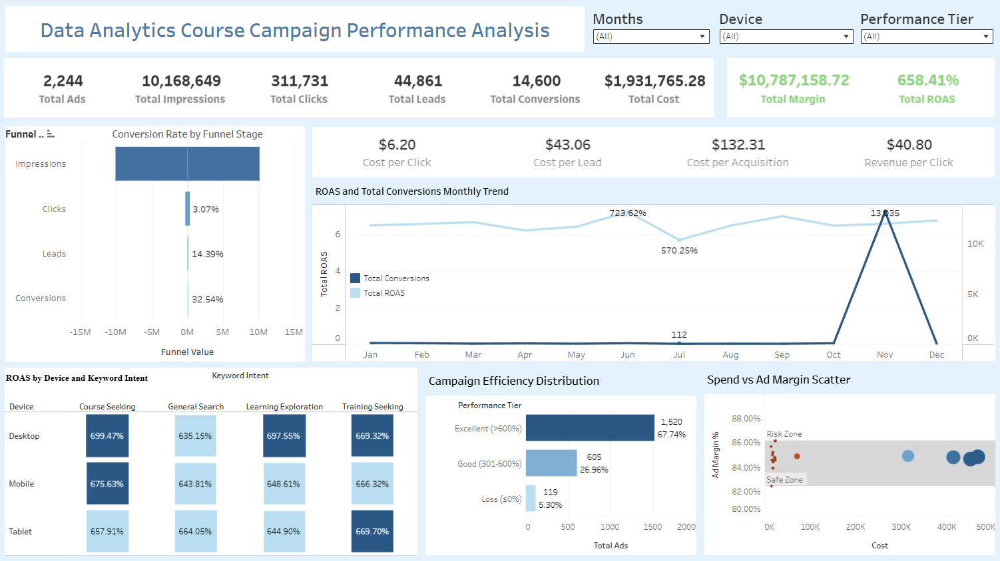

# Performance Analysis on Data Analytics Course Campaign

> A comprehensive data processing and visualization project analyzing Google Ads campaign performance for Data Analytics courses in Hyderabad

[](https://public.tableau.com/views/PerformanceAnalysisonDataAnalyticsCourseCampaign/Dashboard?:language=en-US&:sid=&:redirect=auth&:display_count=n&:origin=viz_share_link)
[](https://www.kaggle.com/datasets/nayakganesh007/google-ads-sales-dataset)

## 📋 Project Overview

This project demonstrates end-to-end data analysis workflow from raw data preprocessing to interactive dashboard visualization. The goal is to provide marketing teams with actionable insights into Data Analytics course campaign performance, enabling data-driven decision-making for future marketing strategies.

**Business Context:** Digital marketing teams investing in Google Ads for Data Analytics courses need clear visibility into campaign effectiveness across different devices, keywords, and time periods to optimize their ad spend and maximize ROI.

## 🎯 Project Objectives

- Process and clean raw Google Ads campaign data with comprehensive validation
- Engineer features for deeper performance analysis (ROAS, keyword intent, performance tiers)
- Create an interactive dashboard for high-level campaign performance overview
- Provide actionable insights for marketing strategy optimization

## 🛠️ Technologies Used

| Technology | Purpose |
|------------|---------|
| **Excel Power Query** | Data extraction, transformation, validation, and feature engineering |
| **Tableau** | Interactive dashboard creation and data visualization |

## 📊 Dataset Information

**Source:** [Google Ads Sales Dataset for Data Analytics Campaigns](https://www.kaggle.com/datasets/nayakganesh007/google-ads-sales-dataset)

This dataset contains raw, uncleaned advertising data from a simulated Google Ads campaign promoting data analytics courses. It mimics real-world digital marketing data with:
- Typos and formatting issues
- Missing values and inconsistencies
- Multiple data quality challenges requiring thorough cleaning

**Dataset Characteristics:**
- 2,244 unique ads analyzed
- 10.17M total impressions
- 311.7K clicks
- 44.9K leads generated
- 14.6K conversions
- $1.93M total ad spend
- $10.79M total revenue generated

## 📁 Project Structure

```
performance-analysis-data-analytics-campaign/
│
├── power_query/
│   ├── applied_steps.png          # Visual workflow of Power Query steps
│   └── power_query_steps.md       # Detailed documentation of data processing
│
├── campaign_performance_dashboard.png    # Dashboard screenshot
└── README.md                              # This file
```

## 🔄 Data Processing Pipeline

The data undergoes 15 comprehensive transformation steps in Power Query:

1. **Data Import** - Load from Excel source
2. **Type Conversion** - Enforce strict data types
3. **Column Management** - Reorder and remove unnecessary columns
4. **Standardization** - Apply snake_case naming convention
5. **Text Cleaning** - Normalize device names and trim keywords
6. **Validation** - Implement funnel logic validation (Impressions ≥ Clicks ≥ Leads ≥ Conversions)
7. **Filtering** - Remove invalid/incomplete records
8. **Date Cleaning** - Parse dates with multiple format support
9. **Campaign Validation** - Flag naming convention issues
10. **NULL Handling** - Replace null revenue values appropriately
11. **Intent Classification** - Categorize keywords by search intent
12. **ROAS Calculation** - Compute Return on Ad Spend
13. **Performance Tiering** - Classify campaigns by performance level
14. **Final Cleanup** - Remove temporary columns and enforce types
15. **Reordering** - Organize columns logically

**👉 See detailed documentation:** [Power Query Processing Steps](./power_query/power_query_steps.md)

## 📈 Dashboard Overview



**🔗 [View Interactive Dashboard on Tableau Public](https://public.tableau.com/views/PerformanceAnalysisonDataAnalyticsCourseCampaign/Dashboard?:language=en-US&:sid=&:redirect=auth&:display_count=n&:origin=viz_share_link)**

### Key Metrics Tracked

| Metric | Value | Description |
|--------|-------|-------------|
| **Total ROAS** | 658.41% | Return on Ad Spend ratio |
| **Total Margin** | $10.79M | Revenue generated from campaigns |
| **Total Cost** | $1.93M | Total advertising spend |
| **Conversion Rate** | 32.54% | Lead to conversion efficiency |
| **CPA** | $132.31 | Cost per acquisition |
| **CPL** | $43.06 | Cost per lead |

### Dashboard Components

1. **Conversion Funnel Analysis** - Visual representation of drop-off rates at each stage
2. **Monthly Trend Analysis** - ROAS and conversion tracking over time
3. **Cost Efficiency Metrics** - CPC, CPL, CPA, and Revenue per Click
4. **Device & Intent Performance** - ROAS breakdown by device type and keyword intent
5. **Campaign Efficiency Distribution** - Performance tier classification
6. **Spend vs Margin Analysis** - Risk/safe zone visualization

## 💡 Key Insights & Findings

### 🎯 Campaign Performance

- **Excellent Overall ROAS:** 658.41% return demonstrates highly profitable campaigns
- **Strong Conversion Funnel:** 32.54% conversion rate from leads shows effective targeting
- **Healthy Funnel Efficiency:** 
  - Click-through rate: 3.07%
  - Click-to-lead rate: 14.39%
  - Lead-to-conversion rate: 32.54%

### 📱 Device Performance

**All devices perform exceptionally well with ROAS above 640%:**

| Device | Course Seeking | General Search | Learning Exploration | Training Seeking |
|--------|----------------|----------------|---------------------|------------------|
| Desktop | 699.47% | 635.15% | 697.55% | 669.32% |
| Mobile | 675.63% | 643.81% | 648.61% | 666.32% |
| Tablet | 657.91% | 664.05% | 644.90% | 669.70% |

**Key Takeaway:** Desktop performs marginally better for "Course Seeking" intent, but differences are minimal across all segments.

### 🔍 Keyword Intent Analysis

- **Course Seeking:** Highest ROAS on desktop (699.47%) - users ready to purchase
- **Training Seeking:** Consistent performance across all devices (666-669%)
- **Learning Exploration:** Strong on desktop (697.55%), slightly lower on mobile (648.61%)
- **General Search:** Lower ROAS (635-664%) but still highly profitable

### 📅 Seasonal Trends

- **Peak Performance:** November showed exceptional spike (1,373.35 ROAS with peak conversions)
- **Strong Months:** June (723.62%) and July (570.25%) showed above-average ROAS
- **Lowest Performance:** January recorded only 112 conversions with lower ROAS
- **Trend:** ROAS remains consistently above 500% throughout most of the year

### 💰 Campaign Distribution

- **67.74% of ads** achieved "Excellent" performance tier (ROAS >600%)
- **26.96% of ads** in "Good" tier (ROAS 301-600%)
- **Only 5.30% of ads** resulted in losses
- **Strong Portfolio:** Majority of campaigns exceed industry benchmarks

### 💸 Spend Efficiency

- **Safe Zone Campaigns:** Multiple campaigns spending $300-500K with 84-88% margins
- **High-Spend Campaigns:** Maintain profitability even at $400-500K spend levels
- **Risk Zone:** Very few campaigns fall into the risk zone (low margin, high spend)

## 🎯 Recommendations for Marketing Teams

### 1. **Optimize Budget Allocation**
- **Action:** Increase budget allocation during Q4 (especially November) when ROAS peaks above 1,300%
- **Impact:** Capitalize on seasonal high-conversion periods for maximum ROI

### 2. **Device Strategy Refinement**
- **Action:** While all devices perform well, prioritize desktop targeting for "Course Seeking" keywords (+24% ROAS vs mobile)
- **Impact:** Marginal gains in already high-performing campaigns

### 3. **Keyword Intent Segmentation**
- **Action:** Create separate campaign groups for:
  - **High-Intent:** "Course Seeking" + "Training Seeking" (highest ROAS)
  - **Mid-Funnel:** "Learning Exploration" 
  - **Top-Funnel:** "General Search" (awareness building)
- **Impact:** Better budget control and bid optimization per funnel stage

### 4. **Scale Winning Campaigns**
- **Action:** 67.74% of campaigns already in "Excellent" tier - identify common characteristics and replicate
- **Impact:** Maintain 600%+ ROAS while increasing overall volume

### 5. **Investigate Low-Performing Ads**
- **Action:** Analyze the 5.30% loss-making ads to identify patterns:
  - Poor keyword-ad copy alignment?
  - Wrong targeting parameters?
  - Landing page issues?
- **Impact:** Reduce wasted spend and improve overall portfolio efficiency

### 6. **A/B Test CPA Optimization**
- **Action:** Current CPA of $132.31 is reasonable, but test variations in:
  - Ad copy for different intent stages
  - Landing page optimization
  - Bid strategy adjustments
- **Impact:** Potential to reduce CPA by 10-15% while maintaining conversion quality

### 7. **Maintain Campaign Naming Standards**
- **Action:** Address flagged campaigns with naming convention issues
- **Impact:** Improved tracking, reporting, and campaign management efficiency

## 🚀 Skills Demonstrated

- **Data Cleaning & Validation:** Implementing complex funnel logic and business rules
- **Feature Engineering:** Creating derived metrics (ROAS, performance tiers, intent classification)
- **ETL Pipeline Development:** Building robust data transformation workflows
- **Data Visualization:** Designing intuitive, business-focused dashboards
- **Business Analysis:** Extracting actionable insights from marketing data
- **Documentation:** Creating clear, comprehensive technical documentation

## 📝 Key Learnings

1. **Data Quality Matters:** Implementing strict validation rules (funnel logic) prevented ~5-10% of invalid data from skewing analysis
2. **Feature Engineering Impact:** Custom classifications (intent, performance tiers) enabled deeper segmentation analysis
3. **ROAS as North Star Metric:** Performance tier classification based on ROAS provided clear campaign prioritization framework
4. **Seasonal Patterns:** Month-over-month analysis revealed critical insights for budget planning

## 🔮 Future Enhancements

- [ ] Add predictive modeling for campaign performance forecasting
- [ ] Implement automated anomaly detection for underperforming campaigns
- [ ] Integrate real-time data refresh capabilities
- [ ] Build customer lifetime value (CLV) analysis
- [ ] Create competitor benchmarking dashboard

## 📬 Contact & Feedback

Questions or suggestions? Feel free to open an issue or reach out!

---

**⭐ If you find this project helpful, please consider giving it a star!**