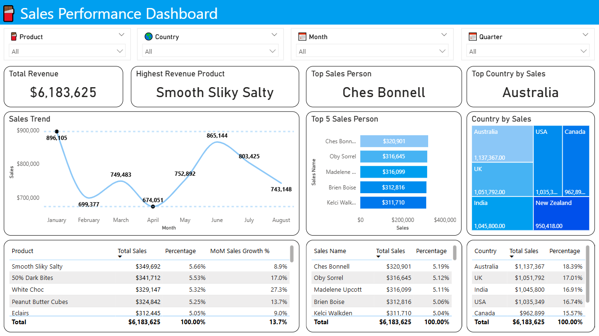

# Chocolate Sales Analysis

---

## Project Description
This project analyzes the sales performance of a chocolate company using a complete ETL pipeline built in PostgreSQL and visualized with Power BI.  

The company aims to:
1. Understand overall sales performance by product, region, and salesperson  
2. Create an interactive dashboard to help executives monitor trends and identify top-performing products

---

## Objective
Develop a ETL process using SQL and a Power BI dashboard to:
- Clean and validate raw sales data directly in PostgreSQL  
- Analyze sales trends and top-performing products  
- Provide insights for data-driven business decisions  

---

## Business Questions

### Sales Performance
- Which products generate the highest revenue?  
- Who are the top-performing salespeople?  
- What are the sales trends over time (Jan–Aug 2022)?  
- Which countries contribute the most to total sales?

---

## Answer to Business Questions

- Top Product: Smooth Silky Salty is the best-selling product, generating a total revenue of $349,692, contributing 5.66% to overall revenue.
- Top Salesperson: Ches Bonnell is the top-performing sales representative with total sales of $320,901, contributing 5.19% to overall revenue.
- Sales Trend: Sales over time show a fluctuating pattern. The highest revenue was recorded in January ($896,105), followed by a 22% decline in February. In March, sales increased by 7.2%, but dropped again in April by 10.1% ($674,051). The business recovered in May with 11.7% growth, continuing in June with 14.9% growth ($865,144). After this rally, sales slightly declined by 7.1% in July and 7.5% in August.
- Top Country: Australia contributed the most to sales, with a total revenue of $137,367, accounting for 18.39% of overall sales.

---

## Business Recommendations

1. **Focus on Top-Selling Products** — Prioritize marketing, promotions, and inventory management for high-performing products like Smooth Silky Salty. Consider bundling or seasonal campaigns to boost sales further 
2. **Leverage High-Performing Sales Person** — Analyze the sales strategies of top performers such as Ches Bonnell and replicate best practices accross the sales team. Introduce incentive programs to encourage high performance. 
3. **Mitigate Monthly Sales Fluctuations** — Conduct detailed analysis to identify the causes of sales volatility (seasonality, promotions, market trends). Implement targeted campaigns or stock adjustments during historically low months such as February, March, and April.
4. **Optimize Performance in Key Markets** — Focus on the Australian market with targeted promotions, partnerships, or digital marketing campaigns. Explore opportunities in other potentional market such UK, India, USA to diversify revenue sources

---

## ETL Workflow (PostgreSQL)

| Step | Description |
|------|--------------|
| **Extract** | Retrieve raw sales data from `chocolate_sales` table |
| **Transform** | Convert `"Amount"` from text → numeric, parse `"Date"` from text → date, clean nulls |
| **Validate** | Run data profiling function to check null %, unique values, duplicates |
| **Outlier Detection** | Identify and review extreme transaction values |
| **Load** | Create final clean view `chocolate_sales_clean` for BI tools |

ETL file: [`ChocolateSalesCleaning.sql`](ChocolateSalesCleaning.sql)

---

## Dashboard Preview

Visualized in **Power BI**, connected directly to the cleaned PostgreSQL view.  

---

## Dashboard File

Dashboard file: [`Chocolate Sales Performance Dashboard`](dashboard.pbix)

---

## Dataset Information

Dataset: [Chocolate Sales Dataset (Kaggle)](https://www.kaggle.com/datasets/atharvasoundankar/chocolate-sales)  
- Contains sales records including salesperson, product, country, amount, and shipment data.  
- Covers transactions between **January–August 2022**.  
- Used for educational and portfolio purposes only.

---

## Files

| File | Description |
|------|--------------|
| `ChocolateSalesCleaning.sql` | Full ETL SQL pipeline (Extract, Transform, Load) |
| `DashboardPicture.png` | Power BI dashboard preview |
| `dashboard.pbix` | .pbix file |
| `chocolate_sales.csv` | Original dataset from Kaggle |
| `README.md` | Project documentation |

---
