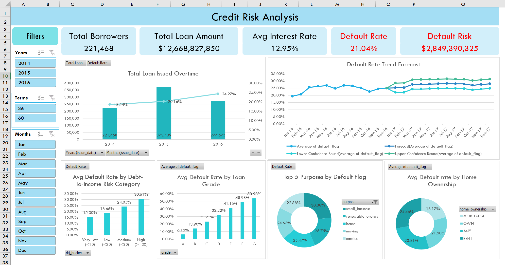

# Credit Risk Analysis – Excel Dashboard

---

## Project Description
This project analyzes credit risk and loan performance using historical loan data from Lending Club, a peer-to-peer lending platform in the United States.

Using Excel and Power Query, the data was cleaned, transformed, and analyzed to identify default patterns across borrower profiles, loan attributes, and time. The final output is an interactive Excel dashboard with trend analysis and a 12-month default rate projection.

---

## Objective
- Analyze default behavior across borrower and loan attributes  
- Measure credit risk exposure using historical loan data  
- Demonstrate data cleaning, transformation, and dashboarding skills using Excel & Power Query  

---

## Dataset Information
Source: Lending Club Loan Dataset (Kaggle)  
- Covers loan data issued within multiple years
- Contains borrower information, loan details, and loan status
- Original dataset size: ~1Million rows, ~145 columns (~1.1GB)

Due to dataset size, the data was:
- Filtered to loans issued between 2014–2016
- Reduced to relevant columns for credit risk analysis
- Fully processed using Power Query

Dataset link:  
https://www.kaggle.com/datasets/adarshsng/lending-club-loan-data-csv

## Tools Used
- Microsoft Excel
- Power Query
- Pivot Tables & Pivot Charts

---

## Data Preparation (Power Query)
All transformations were performed in Excel using Power Query:

### Key Steps:
- Filtered issue date to 2014–2016
- Selected relevant variables for credit risk analysis
- Standardized data types (interest rate, term, income, DTI)
- Removed missing values and duplicates
- Feature engineering:
  - `default_flag`  
    - 1 = Charged Off, Default  
    - 0 = Fully Paid  
  - `dti_bucket`
    - Very Low (<10)
    - Low (<20)
    - Medium (<30)
    - High (>=30)

Power Query steps are documented and reproducible.

---

## Dashboard Preview

---

## Dashboard Overview
The Excel dashboard provides insights into:

- Overall Loan Performance
  - Total borrowers
  - Total loan amount issued
  - Average interest rate
  - Default rate
  - Estimated default risk exposure

- Trend Analysis
  - Loan issuance over time
  - Default rate trend and 12-month projection

- Risk Analysis
  - Default rate by loan grade
  - Default rate by debt-to-income (DTI) category
  - Default rate by home ownership
  - Default rate by loan purpose

- Forecast Analysis
  - 12-month trend-based projection of default rate (2017)

Dashboard includes interactive filters:
- Year
- Loan term (36 / 60 months)
- Issue month

---

## Key Insights
- Default rate increases significantly with higher loan grades (D–G)
- Borrowers with DTI ≥ 30% show the highest default risk
- Home Ownership categorize as 'Renters' have higher average default rates compared to 'mortgage' holders
- Certain loan purposes such as 'small business' and 'medical' exhibit higher default risk
- Trend-based projection indicates a continued elevated default rate into 2017, assuming historical patterns persist

---

## Files
| File | Description |
|------|------------|
| `credit_risk_dashboard.png` | Dashboard preview |
| `applied_steps.png` | Documentation of Power Query transformations |
| `power_query_steps.md` | Detailed Power Query transformations steps |
| `README.md` | Project documentation |

---

## Notes
- Raw data and full Excel files are not included due to file size limitations.
- Forecast results are based on limited historical data (2014–2016) and should be interpreted as trend projections.
- Dataset and complete working files are available upon request.
