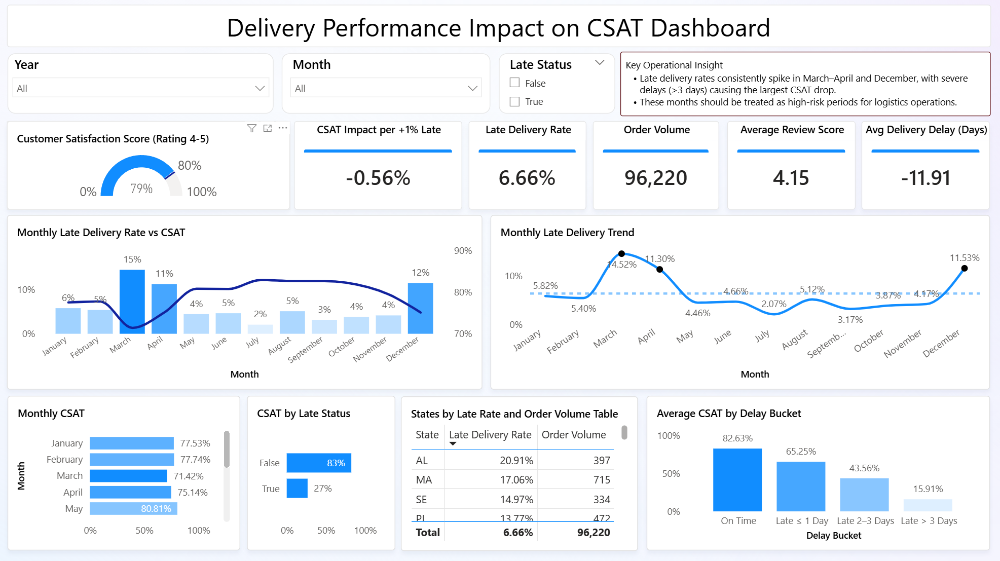

#  E-Commerce Customer Satisfaction Analysis

##  Project Description

Brazil has one of the fastest-growing e-commerce markets in Latin America. With a vast geography, diverse regions, and heavy reliance on third-party logistics, delivery performance plays a critical role in shaping customer experience.

XYZ E-Commerce operates as an online marketplace connecting thousands of sellers with customers across Brazil. As the business scaled and order volumes continued to grow, management began to notice an early warning sign: customer satisfaction ratings started to decline in Q1 2018, despite stable sales performance.

This project analyzes customer satisfaction trends for XYZ E-Commerce using the Brazilian E-Commerce Public Dataset by Olist, with a specific focus on identifying the root cause of declining CSAT in Q1 2018.

---

## Objective

The main objective of this project is to:
- Identify key factors contributing to declining customer satisfaction
- Provide actionable, data-driven recommendations to recover CSAT
- Build Power BI dashboard to maintain and monitoring the root cause

---

## Business Problem

In Q1 2018, XYZ E-Commerce experienced a noticeable decline in customer satisfaction despite stable and increasing order volume. Stakeholders want to understand the root causes and what action should be prioritized to restore customer satisfaction.

---

## Insight

- In Q1 2018, Customer Satisfaction Score (CSAT) decreased by around 4%, from approximately 78% to 74% (percentage of ratings 4–5).
- During the same period, Late Delivery Rate increased from about 8% to 11% (QoQ), indicating a strong relationship between delivery performance and customer satisfaction.
- March 2018 recorded the highest late delivery rate, reaching around 18%, which coincided with the lowest CSAT level (~69%) in Q1.
- Overall analysis shows that each +1% increase in late delivery rate reduces CSAT by approximately 0.56%, highlighting delivery timeliness as a key driver of customer satisfaction.
- On-time deliveries achieve 83% CSAT, while late deliveries 27%.
- Delay severity has a strong impact on CSAT:
On-time (~82%), Late ≤ 1 day (~65%), Late 2–3 days (~44%), and Late > 3 days (~16%).
- When extending the analysis across multiple years, late delivery spikes consistently occur in certain months (especially March–April and December), indicating that the Q1 2018 issue was not a one-time incident, but part of a recurring seasonal delivery problem.
- Several states (AL, MA, SE, PI, CE) consistently show higher late delivery rates, suggesting regional logistics challenges.

---

## Answer to Business Problem

The decline in CSAT during Q1 2018 is primarily caused by a sharp increase in late deliveries, particularly deliveries delayed by more than three days.

While order volume and average review scores remained healthy, delivery delays created a disproportionate negative impact on customer satisfaction, with each incremental increase in late delivery rate producing a measurable CSAT loss.

The issue is operational, not product-related.

---

## Business Recommendations

1. **Improve Delivery Reliability Over Speed**
Focus on meeting promised delivery timelines rather than shortening delivery duration, as reliability has a stronger impact on customer satisfaction than faster but inconsistent shipping.
2. **Monitor and Enforce Logistics Partner Performance** 
Regularly evaluate logistics partners by late delivery rate, delay severity, and CSAT impact; apply SLA penalties or reduce shipment volume for consistently underperforming partners.
3. **Adopt Data-Driven Dynamic ETA**
Replace static delivery estimates with dynamic ETAs based on historical delivery performance by route and logistics partner to better manage customer expectations.
4. **Reduce Severe Delivery Delays (>3 Days)**
Prioritize minimizing extreme delivery delays, as they cause the largest drop in customer satisfaction compared to minor delays.
5. **Apply Region-Based Delivery Strategy**
Adjust delivery expectations, partner selection, and operational policies by region to account for Brazil’s uneven logistics infrastructure.
6. **Strengthen Seller Dispatch Accountability**
Track seller dispatch time and introduce incentives or visibility penalties to reduce delays before orders enter the logistics network.
7. **Prepare Seasonal Delivery Risk Mitigations Plans**
Develop proactive operational plans for high-risk months (March,April, and December), such as adjusted delivery estimation time during these times.

---

## 📊 Dashboard Preview

---

## Dashboard File

Dashboard file: [`Delivery Performance Impact on CSAT Dashboard`](./dashboard/Delivery%20Performance%20Impact%20on%20CSAT%20Dashboard.pbix)

---

## Dataset Information

Dataset: **[Brazilian E-Commerce Public Dataset by Olist](https://www.kaggle.com/datasets/olistbr/brazilian-ecommerce)**  

- This dataset contains customer, location, orders, products, and seller information data .  
- Covers information between 2016-2020
- License: **CC BY-NC-SA 4.0** (non-commercial use, attribution required)

---

## Folder
| Folder | Description |
|------|--------------|
| `dashboard` | Power BI assets, including the .pbix file and dashboard preview images used for documentation |
| `data` | Project datasets, organized into raw (original CSV files) and clean (processed data used by the dashboard and analysis) |
| `notebooks` | Jupyter notebooks for data profiling, exploratory data analysis (EDA), and data wrangling |
| `scripts` | Reusable Python Scripts for Analysis |

---